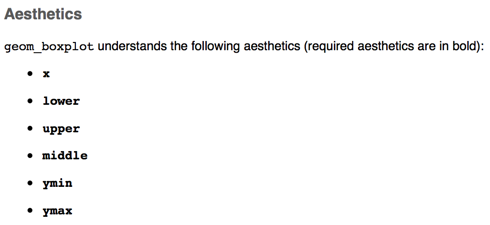

```{r set_this_up, include=FALSE}
knitr::opts_chunk$set(echo = TRUE, cache = FALSE, warning = FALSE, message = FALSE)
knitr::knit_engines$set("yaml")

library(ggplot2)
library(gapminder)

```

class: inverse, middle

## `ggplot2`: data visualization system based on the **grammar of graphics**

--

- Quickly make beautiful, high-quality visualizations
- Map plot characteristics directly to qualities of data
- Automatically create informative plot legends
- Show subsets of data using small multiples

---

# Goals

We will understand how:

- Data are mapped to `aesthetics`
- Plots are built in layers by `geoms`
- Control aesthetics using `scales`
- Show small multiples using `facets`
- Control axes and legends using `scales/guides`
- Change plot appearance using `themes` and other options
- Save plots using `ggsave()`

## Plan

1. General overview of key concepts: `aesthetics`, `geoms`, layering, `scales`, `facets`, `themes`
1. Step-by-step example, to demonstrate details

**Note**: This is not an exhaustive tutorial; it is an overview of the features I use most often. Much more at `ggplot2.tidyverse.org`!

---

# The Grammar of Graphics

- Largely developed by Leland Wilkinson in [*The Grammar of Graphics*](https://www.springer.com/us/book/9780387245447)
- Extended by Hadley Wickham ([paper](http://vita.had.co.nz/papers/layered-grammar.pdf)), original author of `ggplot2`

--

.pull-left[
### A little time learning the grammar ➡️

]

.pull-right[
### Power, ease in creating beautiful, informative graphics
]

--

*(compare this to trying to remember all the arguments to `par`)*

---

# Components of Statistical Graphics

- Data
- Aesthetic mappings of the data (eg, location or size)
- Geometric objects (ie, the shape of the data)
- Scales
- Statistical transformation
- Coordinates

--

```{r make_data, echo = FALSE}
df <- data.frame(xvar = rnorm(n = 100))
df$yvar <- df$xvar * runif(n = 100)

```

.pull-left[
```{r eval = FALSE}
ggplot(
  data = df,
  aes(x = xvar, y = yvar)
) +
  geom_point(stat = "identity") +
  scale_x_continuous(
    limits = c(min(df$xvar), max(df$xvar)),
    name = "X Axis"
  ) +
  scale_y_continuous(
    limits = c(min(df$yvar), max(df$yvar)),
    name = "Y Axis"
  )
```

]

.pull-right[
```{r echo = FALSE, out.height=300}
ggplot(
  data = df,
  aes(x = xvar, y = yvar)
) +
  geom_point(stat = "identity") +
  scale_x_continuous(
    limits = c(min(df$xvar), max(df$xvar)),
    name = "X Axis"
  ) +
  scale_y_continuous(
    limits = c(min(df$yvar), max(df$yvar)),
    name = "Y Axis"
  )
```

]

---

.pull-left[
### Base R

```{r baser}
with(df, plot(yvar ~ xvar))

```

]

.pull-right[

### ggplot2

```{r ggplot2, out.height = 300}
ggplot(
  data = df,
  aes(x = xvar, y = yvar)
) +
  geom_point()

```
]

--

### **Notice**: ggplot2 knows which stat, scales to use by default

---

class: inverse, middle, center

# It Always Starts with Data

`ggplot(data = ..., ...)`

Everything **starts** with a data.frame.

Anything that represents **data** on the plot must be within a data.frame.

---

# Represent Data with `aesthetics`

- "Aesthetics" = how we map the **values** of data to the **appearance** of the plot
- Examples:
    - X, Y axis values
    - Color, shape, sizes of points
    - Opacity, fill of shapes
    
---

```{r show_df, results = "markup"}
print(head(df, n = 3), digits = 2)

```

```{r aes_eg, eval = FALSE}
ggplot(
  data = df, #<<
  aes(x = xvar, y = yvar)
)

```

---

```{r show_df_2, results = "markup"}
print(head(df, n = 3), digits = 2)

```

```{r aes_eg_2, eval = FALSE}
ggplot(
  data = df,
  aes(x = xvar, y = yvar) #<<
)

```

.pull-left[
```{r aes_eg_3, echo = FALSE, fig.asp = 0.7}
ggplot(
  data = df,
  aes(x = xvar, y = yvar)
)

```
]

--

.pull-right[

### What Do You Notice?

- Correct X, Y limits
- Axis labels
- ...no actual data
]

--

### We haven't told it *how* to show the data!

---

class: center, inverse, middle

# `aesthetics` + `geoms` = 👯

---

# Represent Data with `geoms`

`geoms` determine the **shape** of the data.

.pull-left[
```{r geom_eg, eval = FALSE}
ggplot(
  data = df, aes(x = xvar, y = yvar)
) + #<<
  geom_point() #<<

```
]

--

.pull-right[
```{r geom_eg_run, echo = FALSE}
ggplot(data = df, aes(x = xvar, y = yvar)) +
  geom_point()

```
]

---

# Represent Data with `geoms`

`geoms` determine the **shape** of the data.

.pull-left[
```{r geom_line_eg, eval = FALSE}
ggplot(
  data = df, aes(x = xvar, y = yvar)
) + #<<
  geom_line() #<<

```
]

--

.pull-right[
```{r geom_line_eg_run, echo = FALSE}
ggplot(data = df, aes(x = xvar, y = yvar)) +
  geom_line()

```
]

---

.pull-left[
## Different `geoms`...
]

.pull-right[
## different `aesthetics`
]

The `aesthetics` you need depend on the `geom` you want to show.

Examples:

- `geom_point`, `geom_line` each need only X, Y values
- `geom_ribbon` needs X, but rather than a single Y, it needs `ymin` and `ymax`

--

### Your Turn!

Look at the help files for these `geoms` and see what `aesthetics` each one needs.

```
library(ggplot2)
?geom_line
?geom_boxplot
?geom_bar
?geom_ribbon
```

---

# Your Turn!

Using the `gapminder` dataset from the year 2007, show the relationship between `gdpPercap` and `lifeExp` using `aesthetics` and `geoms`.

```{r}
# install.packages("gapminder")
library(gapminder)
head(gapminder)

gap2007 <- subset(gapminder, year == 2007)

```

---

# Your Turn!

```{r}
p <- ggplot(
  data = gap2007,
  aes(x = gdpPercap, y = lifeExp) #<<
)

```

.pull-left[
```{r, out.height = 250, fig.asp = 0.6}
p +
  geom_point() #<<
```
]

.pull-right[
```{r, out.height = 250, fig.asp = 0.6}
p +
  geom_line() #<<
```
]

---

# `geoms` + `stats`

Some `geoms` require the user to supply all the information needed to map each point.

- `geom_point`, `geom_line`, `geom_ribbon`

--

Others use `stats` behind the scenes to summarize the data.

.pull-left[
```{r, eval = FALSE}
ggplot(
  data = df, aes(x = 1, y = yvar)
) +
  geom_boxplot()

```


]

.pull-right[
```{r, echo = FALSE, fig.asp = 0.8}
ggplot(data = df, aes(x = 1, y = yvar)) +
  geom_boxplot()

```

]

Often we won't need to call `stats` explicitly; `geoms` have excellent defaults that do much of the work for us!

---

class: inverse, middle, center

# Layers = Power 💪

---

## Scenario: Raw Data + Regression Line

We want to represent the same data, using a summary as well as the raw data.

We can do this by **layering** `geoms`.

.pull-left[
```{r, eval = FALSE}
ggplot(
  data = gap2007,
  aes(x = gdpPercap, y = lifeExp)
) +
  geom_point() #<<

```
]

.pull-right[
```{r, echo = FALSE}
ggplot(data = gap2007, aes(x = gdpPercap, y = lifeExp)) +
  geom_point()

```
]

---

## Scenario: Raw Data + Regression Line

We want to represent the same data, using a summary as well as the raw data.

We can do this by **layering** `geoms`.

.pull-left[
```{r, eval = FALSE}
ggplot(
  data = gap2007,
  aes(x = gdpPercap, y = lifeExp)
) +
  geom_point() +
  geom_smooth() #<<

```
]

.pull-right[
```{r, echo = FALSE}
ggplot(data = gap2007, aes(x = gdpPercap, y = lifeExp)) +
  geom_point() +
  geom_smooth()

```
]

---

## Scenario: Raw Data + Regression Line

We want to represent the same data, using a summary as well as the raw data.

We can do this by **layering** `geoms`.

.pull-left[
```{r, eval = FALSE}
ggplot(
  data = gap2007,
  aes(x = gdpPercap, y = lifeExp)
) +
  geom_point() +
  geom_smooth() +
  geom_rug() #<<

```
]

.pull-right[
```{r, echo = FALSE}
ggplot(data = gap2007, aes(x = gdpPercap, y = lifeExp)) +
  geom_point() +
  geom_smooth() +
  geom_rug()

```
]

---

# Your Turn!

Summarize and show raw data for each country's gross domestic product (`gdpPercap`).

For extra credit 😁, do this separately for each **continent**.

- What `geoms` would you use?
- What `aesthetics` would you use?

--

.pull-left[
```{r, eval = FALSE}
ggplot(
  data = gap2007,
  aes(x = continent, y = gdpPercap)
) +
  geom_boxplot() +
  geom_point()

```

### What would you change?

]

.pull-right[
```{r, echo = FALSE, out.height = 300, fig.asp = 0.7}
ggplot(
  data = gap2007,
  aes(x = continent, y = gdpPercap)
) +
  geom_boxplot() +
  geom_point()

```
]

---

# Positions

`positions` help us change the position of data a bit. Positions are still based on `aesthetics`, but sometimes it is helpful to modify those values.

For example, you may have many single points with the same value, or several groups contained within one value.

--

Common `position` functions:

- `position_dodge()`: vertical position stays the same; horizontal changes
- `position_stack()`: stacks bars on top of one another
- `position_fill()`: stacks bars *and* standardizes each to the same height
- `position_jitter()`: adds random noise to values to avoid overplotting

---

# Example: Barcharts

.pull-left[
```{r}
rct_df <- data.frame(
  trt = factor(c("A", "A", "B", "B")),
  sex = factor(rep(c("Male", "Female"), 2)),
  npts = c(52, 48, 65, 75)
)

```

```{r, eval = FALSE}
ggplot(
  data = rct_df,
  aes(x = trt, y = npts,
      group = sex, fill = sex)
) +
  geom_bar(
    stat = "identity",
    position = position_dodge() #<<
  )

```
]

.pull-right[
### `position_dodge()`
```{r, echo = FALSE, out.height = 350}
ggplot(data = rct_df, aes(x = trt, y = npts, group = sex, fill = sex)) +
  geom_bar(stat = "identity", position = position_dodge())

```
]

---

# Example: Barcharts

.pull-left[
```{r, eval = FALSE}
rct_df <- data.frame(
  trt = factor(c("A", "A", "B", "B")),
  sex = factor(rep(c("Male", "Female"), 2)),
  npts = c(52, 48, 65, 75)
)

```

```{r, eval = FALSE}
ggplot(
  data = rct_df,
  aes(x = trt, y = npts,
      group = sex, fill = sex)
) +
  geom_bar(
    stat = "identity",
    position = position_stack() #<<
  )

```
]

.pull-right[
### `position_stack()`
```{r, echo = FALSE, out.height = 350}
ggplot(data = rct_df, aes(x = trt, y = npts, group = sex, fill = sex)) +
  geom_bar(stat = "identity", position = position_stack())

```
]

---

# Example: Barcharts

.pull-left[
```{r}
rct_df <- data.frame(
  trt = factor(c("A", "A", "B", "B")),
  sex = factor(rep(c("Male", "Female"), 2)),
  npts = c(52, 48, 65, 75)
)

```

```{r, eval = FALSE}
ggplot(
  data = rct_df,
  aes(x = trt, y = npts,
      group = sex, fill = sex)
) +
  geom_bar(
    stat = "identity",
    position = position_fill() #<<
  )

```
]

.pull-right[
### `position_fill()`
```{r, echo = FALSE, out.height = 350}
ggplot(data = rct_df, aes(x = trt, y = npts, group = sex, fill = sex)) +
  geom_bar(stat = "identity", position = position_fill())

```
]

---

# Positions

Because `positions` are *functions*, we can add arguments to control them further.

.pull-left[
```{r, eval = FALSE}
ggplot(
  data = rct_df,
  aes(x = trt, y = npts,
      group = sex, fill = sex)
) +
  geom_bar(
    stat = "identity",
    position =
      position_dodge2(padding = 0.2) #<<
  )

```
]

.pull-right[
```{r, echo = FALSE}
ggplot(data = rct_df, aes(x = trt, y = npts, group = sex, fill = sex)) +
  geom_bar(stat = "identity", position = position_dodge2(padding = 0.2))

```
]

---

# Positions

But if we want the default position settings, we can use shortcuts:

.pull-left[
```{r, eval = FALSE}
ggplot(
  data = rct_df,
  aes(x = trt, y = npts,
      group = sex, fill = sex)
) +
  geom_bar(
    stat = "identity",
    position = "dodge2" #<<
  )

```
]

.pull-right[
```{r, echo = FALSE}
ggplot(data = rct_df, aes(x = trt, y = npts, group = sex, fill = sex)) +
  geom_bar(stat = "identity", position = "dodge2")

```
]

---

# Your Turn!

Take the boxplot we made earlier and use a `position` to reduce the overplotting of the raw data.

.pull-left[
```{r, eval = FALSE}
ggplot(
  data = gap2007,
  aes(x = continent, y = gdpPercap)
) +
  geom_boxplot() +
  geom_point()

```

]

.pull-right[
```{r, echo = FALSE, out.height = 300, fig.asp = 0.7}
ggplot(
  data = gap2007,
  aes(x = continent, y = gdpPercap)
) +
  geom_boxplot() +
  geom_point()

```
]

---

# Your Turn!

.pull-left[
```{r, eval = FALSE}
ggplot(
  data = gap2007,
  aes(x = continent, y = gdpPercap)
) +
  geom_boxplot() +
  geom_point(
    position = "jitter" #<<
  )

```

]

.pull-right[
```{r, echo = FALSE, out.height = 300, fig.asp = 0.7}
ggplot(
  data = gap2007,
  aes(x = continent, y = gdpPercap)
) +
  geom_boxplot() +
  geom_point(position = "jitter")

```
]

---

# Your Turn!

.pull-left[
```{r, eval = FALSE}
ggplot(
  data = gap2007,
  aes(x = continent, y = gdpPercap)
) +
  geom_boxplot() +
  geom_point(
    position =
      position_jitter(width = 0.25) #<<
  )

```

]

.pull-right[
```{r, echo = FALSE, out.height = 300, fig.asp = 0.7}
ggplot(
  data = gap2007,
  aes(x = continent, y = gdpPercap)
) +
  geom_boxplot() +
  geom_point(position = position_jitter(width = 0.2))

```
]

---

# Inheritance

### Did You Notice...

...so far, we have only explicitly specified our `data` and `aesthetics` in the initial `ggplot()` call?

Even when we had three separate layers!

--

`ggplot2` uses **inheritance**. This means that each layer uses the same `data` and `aesthetics` set in `ggplot(...)`, unless we tell it otherwise.

- **Simplicity**: Inheritance means we don't have to specify data and aesthetics multiple times
- **Power**: We can use different datasets or aesthetics for each layer if we want to

---

## Example of Inheritance: Marginal Effects Plots

.pull-left[
We may show the point estimate and confidence interval for a continuous variable from a linear regression model using `geom_line` and `geom_ribbon`, then show the *original, unadjusted* data using `geom_point`.

```{r, echo = FALSE, out.height = 300}
library(rms)

dd_gap <- datadist(gap2007)
options(datadist = "dd_gap")

gap_mod <- ols(gdpPercap ~ rcs(lifeExp, 4) + rcs(pop, 4), data = gap2007)
gap_pred <- as.data.frame(Predict(gap_mod, lifeExp = NA))

ggplot(data = gap_pred, aes(x = lifeExp, y = yhat)) +
  geom_ribbon(aes(ymin = lower, ymax = upper), alpha = 0.3) +
  geom_line() +
  geom_point(data = gap2007, aes(x = lifeExp, y = gdpPercap))

```
]

.pull-right[
```{r, eval = FALSE}
ggplot(
  data = predvals,
  aes(x = pointest, y = adjvalue)
) +
  ## Use inherited data;
  ##  specify aesthetics
  geom_ribbon(
    aes(ymin = lcl, ymax = ucl)
  ) +
  ## Use inherited data + aesthetics
  geom_line() +
  ## Add raw data
  geom_point(
    aes(x = covar, y = orgvalue),
    data = orgdata
  )
```
]

---

class: inverse, middle, center

# ⚖️ Scales for Details ⚖️

.pull-left[
## aesthetics

**What** data is mapped to which plot characteristic

`aes(x = ...)`

]

.pull-right[
## scales

**How** to map<br>data to plot characteristics

`scale_x_...(...)`
]

---

## Boxplot Example

.pull-left[
### `aes(thetics)`

Put `gdpPercap` on Y axis

```{r, eval = FALSE}
ggplot(
  data = gap2007,
  aes(x = continent, y = gdpPercap)
) +
  geom_boxplot() +
  geom_point() +
  scale_y_continuous(            #<<
    limits = c(0, 5000),         #<<
    breaks = seq(0, 5000, 1025), #<<
    labels = scales::comma,      #<<
    name = "GDP per Capita"      #<<
  )                              #<<

```
]

.pull-right[
### `scales`

- Set the axis limits
- "Break" axis at these places
- "Name" the axis "GDP Per Capita"

```{r, echo = FALSE, fig.height = 250, fig.asp = 0.5}
ggplot(
  data = gap2007,
  aes(x = continent, y = gdpPercap)
) +
  geom_boxplot() +
  geom_point() +
  scale_y_continuous(
    limits = c(0, 50000),
    breaks = seq(0, 50000, 5000),
    labels = scales::comma,
    name = "GDP per Capita"
  )

```

]

**Note**: `ggplot2` automatically set gridlines at our break points!

---
## Barchart Example

**Note** how `scales` control the legend!

.pull-left[
### `aes(thetics)`

"Fill" the bars with colors by sex

```{r, eval = FALSE}
ggplot(
  data = rct_df,
  aes(x = trt, y = npts,
      group = sex, fill = sex)
) +
  geom_bar(
    stat = "identity",
    position = "dodge2"
  ) +
{{  scale_fill_hue(
    h = c(90, 270), l = 40,
      ## change *hues*, *lightness*
    name = "Patient Sex"
      ## change *name*
  ) }}

```
]

.pull-right[
### `scales`

- Use a different color palette
- Change name to "Patient sex"

```{r, echo = FALSE, fig.height = 250, fig.asp = 0.8}
ggplot(data = rct_df, aes(x = trt, y = npts, group = sex, fill = sex)) +
  geom_bar(stat = "identity", position = "dodge2") +
  scale_fill_hue(h = c(90, 270), l = 40, name = "Patient Sex")
```
]

---

# Types of `scales`

**Scales** generally correspond to **aesthetics**. Some common scale types:

- `scale_[x, y]_[continuous/discrete]`
- `scale_[colour, fill]_[many options!]`
- `scale_size_...`, `scale_shape_...`, `scale_alpha_...`

This is *not* an exhaustive list. See the [`ggplot2` reference pages](http://ggplot2.tidyverse.org/reference/index.html) for more options.

*Note: For `color` scales and aesthetics, you can use either `color` or `colour`.*

--

`scales` have intelligent default values, but you can use different scale types to use specific values you choose. Examples:

- A particular color palette
- Beginning and ending sizes (maybe you want the smallest size to still be seen on a projector)
- Breaks on X, Y axes at clinically relevant points

---

# Your Turn!

Using the boxplot we made earlier, use `scales` *(and maybe `aesthetics`)* to

1. Change the name of the X axis
1. Make each country's raw data a different color
1. *Not* include a legend

`?scale_x_discrete`

`?scale_color_hue`

--

.pull-left[
```{r, eval = FALSE}
ggplot(
  data = gap2007,
  aes(x = continent, y = gdpPercap)
) +
  geom_boxplot(outlier.shape = NA) +
  geom_point(
    aes(color = continent), #<<
    position =
      position_jitter(width = 0.2),
    alpha = 0.6
  ) +
  scale_x_discrete(name="Continent") + #<<
  scale_color_hue(guide = FALSE)       #<<

```
]

.pull-right[
```{r, echo = FALSE, fig.height = 250, fig.asp = 0.7}
ggplot(data = gap2007, aes(x = continent, y = gdpPercap)) +
  geom_boxplot(outlier.shape = NA) +
  geom_point(
    aes(color = continent),
    position = position_jitter(width = 0.2), alpha = 0.6
  ) +
  scale_x_discrete(name = "Continent") +
  scale_color_hue(guide = FALSE)

```
]

---

# Choosing a color scale

By default, `ggplot2` uses color scales that allow for the most difference between categories on a [color wheel](), or to show a spectrum of continuous values.

You can change these defaults in several ways, including:

- Tweak the defaults with `scale_color_hue()` or `scale_color_gradient()` - for example, change the gradient color from the default blue to green, or change the range of hues for a categorical variable
- Use one of the built-in ColorBrewer schemes, which are built to handle sequential, diverging, and qualitative color schemes (`scale_color_brewer()` for categorical, `scale_color_distiller()` for continuous)
- Supply a manual color scheme, using words like `"blue"` or hex colors (eg, `#FAFAFA`): `scale_color_manual()`
- I personally like the `viridis` color schemes. *(These are not currently included in `ggplot2` itself, but will be in the next version released to CRAN this summer. You can install the [`viridisLite`](https://cran.r-project.org/package=viridisLite) package to use them now.)* These scales print well, even in black & white, and are built to be perceived by people with color blindness.

(All scale options above also apply to `scale_fill_xxxx`)

---

# Color Scale Examples: Default Hues

```{r}
p <- ggplot(data = gap2007, aes(x = gdpPercap, y = lifeExp)) +
  geom_point(aes(color = country, size = pop), alpha = 0.5)
```

```{r, fig.asp = 0.7}
p + scale_color_hue(guide = FALSE)
```

---

# Color Scale Examples: Manual Values

```{r, fig.asp = 0.7}
p + scale_color_manual(values = country_colors, guide = FALSE)
```

---

# Color Scale Examples: `viridis`

```{r, fig.asp = 0.7}
library(viridisLite)
  ## or install development version of
  ## ggplot2 from Github

p + scale_color_viridis_d(guide = FALSE)
```

---

class: inverse, middle, center

# 🔠 Same Concept, Many `facets` 🔢

We can use `facets` to show the same visualization for related groups.

---

# Example: GDP vs Life Expectancy

```{r, fig.height = 400, fig.asp = 0.7}
ggplot(data = gap2007, aes(x = gdpPercap, y = lifeExp)) +
  facet_wrap(~ continent) + #<<
  geom_point() +
  geom_smooth()

```
---

.pull-left[
## `facet_wrap()`

You have **one** categorical variable
]

.pull-right[
## `facet_grid()`

You have **two** categorical variables, want to show each combination
]

<hr>

Both have these arguments (among others):

- `nrow`, `ncol`: if you want a specific layout
- `scales`
    - `fixed`: default; same for every panel
    - `free_y`, `free_x`, `free`: allow X and/or Y axis to change for each panel

---

### `facet_grid()` example

*First + last years available for each continent in the `gapminder` data*

.pull-left[
```{r, eval = FALSE}
ggplot(
  data = subset(
    gapminder,
    year %in% c(1952, 2007) &
      !(continent == "Oceania")
  ),
  aes(x = gdpPercap, y = lifeExp)
) +
  facet_grid(year ~ continent) + #<<
  geom_point() +
  geom_smooth()

```
]

.pull-right[
```{r, echo = FALSE}
ggplot(
  data = subset(
    gapminder,
    year %in% c(1952, 2007) &
      !(continent == "Oceania")
  ),
  aes(x = gdpPercap, y = lifeExp)
) +
  facet_grid(year ~ continent) +
  geom_point() +
  geom_smooth()

```
]

--

Leaving scales consistent between panels is great for comparisons between panels (like here). If we are more interested in informing than comparison, we may want to let the scales vary by panel.

---

### `facet_grid()` example

.pull-left[
```{r, eval = FALSE}
ggplot(
  data = subset(
    gapminder,
    year %in% c(1952, 2007) &
      !(continent == "Oceania")
  ),
  aes(x = gdpPercap, y = lifeExp)
) +
  facet_grid(
    year ~ continent,
    scales = "free_x" #<<
  ) +
  geom_point() +
  geom_smooth()

```
]

.pull-right[
```{r, echo = FALSE}
ggplot(
  data = subset(
    gapminder,
    year %in% c(1952, 2007) &
      !(continent == "Oceania")
  ),
  aes(x = gdpPercap, y = lifeExp)
) +
  facet_grid(year ~ continent, scales = "free_x") +
  geom_point() +
  geom_smooth()

```
]

--

The X axis scales for each column are still the same for the two *rows*, allowing us to see the differences between 1952 and 2007 clearly for each continent.

But the X axis scales are different from *column to column*; we can see the relationships for Africa without being affected by the larger GDPs found in Europe, for example.

---

# Your Turn!

Using the original `gapminder` data for 1952 and 2007, update your boxplots of GDP by continent to show one column for each of those two years, and one row for each continent.

*Hint: You can set the X aesthetic to always be 1.*

--

.pull-left[
```{r, eval = FALSE}
ggplot(
  data = subset(
    gapminder, year %in% c(1952, 2007)
  ),
  aes(
    x = 1,        #<<
    y = gdpPercap
  )
) +
{{ facet_grid(
    continent ~ year,
    scales = "free_y"
  ) + }}
  geom_boxplot() +
  geom_point()

```
]

.pull-right[
```{r, echo = FALSE, fig.height = 350, fig.asp = 0.75}
ggplot(data = subset(gapminder, year %in% c(1952, 2007)),
       aes(x = 1, y = gdpPercap)) +
  facet_grid(continent ~ year, scales = "free_y") +
  geom_boxplot() +
  geom_point()

```
]

---

class: inverse, middle, center

# 🌺 Themes 🌺

Give your plots a different look

Control plot elements not related to data

---

# Change the look of your plot

Using `ggplot2 themes`, it is easy to give your plots a different look with one line.

```{r}
p <- ggplot(data = gap2007, aes(x = gdpPercap, y = lifeExp)) +
  geom_point()

```

.pull-left[
```{r, fig.height = 5}
p + theme_bw()

```
]

.pull-right[
```{r, fig.height = 5}
p + theme_minimal()

```
]

---

# Changing Plot Elements with `themes`

We also use `themes` to change elements of the plot that are not related to `data`:

.pull-left[
- Increase font sizes
- Change colors or font faces
- Change plot backgrounds, gridlines

```{r, fig.height = 5.5}
p + theme_minimal()

```
]

.pull-right[
```{r, fig.height = 5.5}
p + theme_minimal() +
  theme(
    panel.border = element_rect(
      fill = NA,
      color = "#b756b9",
      size = 5
    )
  )
```

]

---

# `elements`

Pieces of the `theme` are controlled by the `element` functions *(examples)*:

- `element_line()`: gridlines, axis lines
- `element_text()`: axis labels, titles, captions
- `element_rect()`: plot and panel backgrounds, `facet` strip backgrounds
- `element_blank()`: can be used for any element to "make it disappear"

Use these functions to set aspects like sizes, colors, font faces...

---

# Your Turn!

Give a boxplot we made earlier a different overall `theme`, then customize at least one element. You might...

- Make the axis text **bold** or bigger
- Make the gridlines thicker or disappear
- Make the `strip.background` a different color

--

```{r, echo = FALSE}
p <- ggplot(
  data = subset(gapminder, year %in% c(1952, 2007)),
  aes(x = 1, y = gdpPercap)
) +
  facet_grid(continent ~ year, scales = "free_y") +
  geom_boxplot(outlier.shape = NA) +
  geom_point(
    aes(color = continent),
    alpha = 0.5, position = position_jitter(width = 0.2)
  )

```

.pull-left[
```{r, eval = FALSE}
p +
  theme_minimal() +
  theme(
    axis.title.x = element_blank(),
    axis.text.x = element_blank(),
    strip.background =
      element_rect(fill = "gray90"),
    panel.background =
      element_rect(fill = NA, color = "gray90"),
    legend.position = "none"
  )

```
]

.pull-right[
```{r, echo = FALSE, fig.asp = 0.75}
p + theme_minimal() +
  theme(
    axis.title.x = element_blank(),
    axis.text.x = element_blank(),
    strip.background = element_rect(fill = "gray90"),
    panel.background = element_rect(fill = NA, color = "gray90"),
    legend.position = "none"
  )

```
]

---

# Adding Labels and Titles

We may want to add a title to our plot, or a caption to give additional information about how something was defined. Maybe we want to name an aesthetic "Patient Sex" instead of "sex" but with less typing than `scale_x_discrete(name = "Patient Sex")`.

`labs()` allows us to set these elements:

- `title`
- `subtitle`
- `caption`
- titles for `aesthetics` (these will show up in the legend, or X/Y axis titles)

```{r, eval = FALSE}
p +
  labs(x = "My X axis title")

```

--

## Your Turn!

Use `labs()` to add a plot title and change the Y axis title on the plot you just made.

---

## Controlling Non-Data Elements

To control elements of the plot that *represent* data, but not in a way directly *tied* to our data, we can still use aesthetic qualities. However, we will set them *outside* the `aes(...)` function.

**Example:** We want all our points to be a certain color, or to make a line width thicker to be seen better in a presentation.

.pull-left[
```{r, eval = FALSE}
ggplot(
  data = gap2007,
  aes(x = gdpPercap, y = lifeExp)
) +
  geom_point(
    color = "#a7a9ac",
    alpha = 0.75,
    size = 1.25
  ) +
  geom_smooth(
    fill = "#532354",
    color = "#b756b9",
    alpha = 0.2,
    size = 2
  ) +
  geom_rug(
    alpha = 0.3, color = "#532354"
  )

```
]

.pull-right[
```{r, echo = FALSE}
ggplot(data = gap2007, aes(x = gdpPercap, y = lifeExp)) +
  geom_point(color = "#a7a9ac", alpha = 0.75, size = 1.25) +
  geom_smooth(fill = "#532354", color = "#b756b9", alpha = 0.2, size = 2) +
  geom_rug(alpha = 0.3, color = "#532354")

```
]

---

class: inverse, center, middle

# 🌎 Full Examples with `gapminder` 🌏

---

## Goal

Create a publication-quality chart showing the relationship between gross domestic product and life expectancy, 1952 and 2007.

### Preparation

.pull-left[

1) Create a subset of the data
```{r}
## Only look at 1952, 2007
gap_sub <- subset(
  gapminder,
  year %in% c(1952, 2007)
)

```

2) Initialize our plot object

```{r}
gdp_exp <- ggplot(
  data = gap_sub,
  aes(x = gdpPercap, y = lifeExp)
)
```
]

.pull-right[
```{r, fig.height = 5.5}
gdp_exp
```
]

---

## `facet` by year and continent

```{r}
gdp_exp <- gdp_exp +
  facet_grid(year ~ continent)
```

```{r, echo = FALSE, fig.width = 10, fig.asp = 0.6}
gdp_exp
```

---

## Add data points

We want to use a different color for each country, and make our point sizes vary according to the countries' population size.

```{r}
gdp_exp <- gdp_exp +
  geom_point(
    aes(color = country, size = pop),
    alpha = 0.6 ## to help overplotting
  )
```

--

```{r, echo = FALSE, fig.width = 8, fig.asp = 0.5}
gdp_exp
```

---

## 😱 Fix it! With `scales`

As we saw, a legend for color will not be helpful; there are too many countries.

However, a legend *would* be helpful for the population sizes.

We will use two `scales` to

1) Specify the colors we want, using `scale_color_manual` and `country_colors`, a named vector of hex colors that comes with the `gapminder` package

```{r}
head(country_colors)
```

2) Format a legend for our population sizes

---

## Modification of `scales`

.pull-left[
```{r}
gdp_exp <- gdp_exp +
  scale_color_manual(
    ## Manually specify colors
    values = country_colors,
    ## Turn off the legend for colors
    guide = FALSE
  ) +
  scale_size(
    range = c(3, 7),
    labels = function(x){
      scales::comma(x / 1000000)
    },
    name =
      "Population\n(x 1M)"
  )
  
```
]

.pull-right[
```{r, echo = FALSE}
gdp_exp
```
]

---

# Exploratory data analysis

We see that there is a lot of space on the X axis that may be unnecessary, possibly caused by one point. What point is it?

.pull-left[
```{r, eval = FALSE}
ggplot(
  data = gap_sub,
  aes(x = gdpPercap)
) +
  geom_histogram()
```
]

.pull-right[
```{r, echo = FALSE, fig.height = 4}
ggplot(data = gap_sub, aes(x = gdpPercap)) +
  geom_histogram()
```
]

--

The extreme outlier in 1952 is from Kuwait; looking at other years in the `gapminder` data, it seems to be a legitimate value, but including it is keeping us from seeing the other data as clearly.

We'll exclude it from our plot, but will make a note in a figure caption.

---

# Modify X axis `scale`

```{r}
## Save X axis title to a string so we can see the whole thing
xtitle <- "Gross Domestic Product per Capita\n(x $1,000 USD)"
```

.pull-left[
```{r}
gdp_exp <- gdp_exp +
  scale_x_continuous(
    limits = c(0, 55000),
    labels = function(x){
      scales::dollar(x / 1000)
    },
    name = xtitle
  )

```
]

.pull-right[
```{r, echo = FALSE}
gdp_exp

```
]

---

## Add Labels

```{r}
plottitle <- "GDP vs Life Expectancy, 1952 and 2007"
captitle <- sprintf(
  "Kuwait's 1952 values were excluded due to its extremely high GDP of $%s.\nAverage life expectancy at that time was %s.",
  format(
    round(subset(gap_sub, year == 1952 & country == "Kuwait")$gdpPercap),
    big.mark = ","
  ),
  round(subset(gap_sub, year == 1952 & country == "Kuwait")$lifeExp, 1)
)
```

.pull-left[
```{r}
gdp_exp <- gdp_exp +
  labs(
    title = plottitle,
    subtitle =
      "Source: gapminder.org/data",
    caption = captitle,
    y = "Life Expectancy (Years)"
  )
```
]

.pull-right[
```{r, echo = FALSE, fig.asp = 0.7}
gdp_exp
```
]

---

# Modify Theme Elements

.pull-left[
We want to

- Add space between the X axis and title
- Add space between X axis title and caption
- Italicize the caption
- Bold plot titles, axis titles, and strip text
- Move the legend to the bottom
]

.pull-right[
```{r}
gdp_exp <- gdp_exp +
  theme_bw() +
  theme(
    plot.title = element_text(
      face = "bold", size = 16
    ),
    axis.title.x = element_text(
      vjust = 0
    ),
    plot.caption = element_text(
      vjust = 0, face = "italic"
    ),
    strip.text = element_text(
      face = "bold", size = 12
    ),
    legend.position = "bottom",
    legend.direction = "horizontal"
  )
```
]

---

# Final Result

```{r, echo = FALSE, fig.width = 10}
gdp_exp
```

---

# Your Turn!

Using any of these strategies (or others!), make changes to the boxplots we've been working with.

Some ideas:

- Changing the color of the boxplots, or removing the inside altogether
- Changing the breaks of the Y axis
- Adding axis, plot titles
- Citing the source of our data

Any other ideas are welcome!

---

# Saving Your Plots

The `ggsave` function allows us to easily save our figures in several formats. For example, you might want to create a PDF of the figure for a journal submission, but have a PNG for PowerPoint presentations.

.pull-left[
```{r}
ggsave(
  filename =                    #<<
    "gapminder_gdplifeexp.pdf", #<<
  gdp_exp,
  device = "pdf",               #<<
  path = "figures/",
  width = 10,
  height = 7,
  units = "in"
)
```
]

.pull-right[
```{r}
ggsave(
  filename =                    #<<
    "gapminder_gdplifeexp.png", #<<
  gdp_exp,
  device = "png",               #<<
  path = "figures/",
  width = 10,
  height = 7,
  units = "in"
)
```
]

--

## Your Turn!

Save the results of your plot to a `figures/` directory in two different formats.

---

# Helpful Resources

- [`ggplot2` reference page](ggplot2.tidyverse.org)
- Cookbook for R
- [Data visualization](http://r4ds.had.co.nz/data-visualisation.html) and [graphics for communication](http://r4ds.had.co.nz/graphics-for-communication.html), *R for Data Science*
- [`ggplot2` extensions](http://www.ggplot2-exts.org/gallery/), for `geoms` that are not included in `ggplot2` itself
- [`ggthemr`]() for building custom themes and color palettes *(not currently on CRAN; install from Github)*
- Color palettes:
    - ColorBrewer
    - [colorhexa.com](colorhexa.com)
- Theoretical basis:
    - [`ggplot2`: Elegant Graphics for Data Analysis](http://amzn.to/2fncG50)
    - [Grammar of Graphics]()
